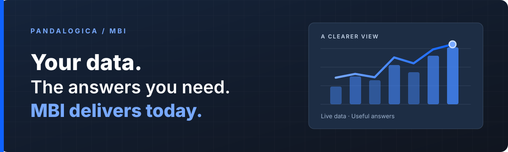
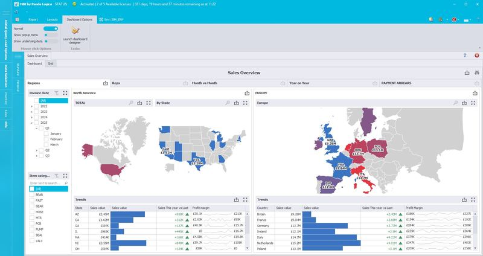

<strong>Your data. The answers you need. MBI delivers today.</strong>

<a href="https://pandalogica.com/">Visit pandalogica.com</a> &nbsp;·&nbsp; <a href="https://pandalogica.com/help/contact">Talk to our team</a>

## Business intelligence built around the data you already have

MBI turns information in your business systems into dashboards and reports that help people understand what is happening and decide what to do next. It connects to IBM i data without requiring a separate copy of that data for reporting.

### 01 / See the whole picture

Bring the measures that matter together in clear, interactive dashboards. Start with an overview, then look more closely where something needs attention.

### 02 / Follow the detail

Move from a dashboard into detailed reports. Explore the records behind a result and find related views without losing the question you started with.

### 03 / Keep everyone informed

Save useful layouts and schedule reports for the people who need them. Your team can return to a familiar view while the underlying business data stays current.

## MBI in view

*MBI Sales overview dashboard, featured on [pandalogica.com](https://pandalogica.com/).*

## Start with a useful foundation

Where a compatible accelerator pack is available, prepared reports can give teams a starting point on their live data. Adapt those reports and layouts as questions change.

**See how MBI could work with your systems.** [Explore the public website](https://pandalogica.com/) or [get in touch](https://pandalogica.com/help/contact).
